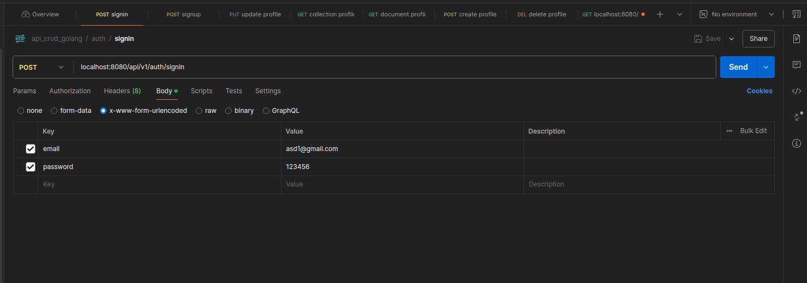

# API CRUD Golang
## Instruction Setup
1. Install MySQL this project using mysql `https://dev.mysql.com/downloads/installer/`
2. Install all package dependencies using
    ```
   go mod download
   ```
3. Check dependency injection using `wire` on terminal
   ```
   wire
   ```
4. Change configuration on MySQL in `wire.go` funtcion `InitializeDB`
    ```
   db.ConnectDB("change username:change password@tcp(127.0.0.1:3306)/change database?charset=utf8mb4&parseTime=True&loc=Local")
    ```
5. Now test migration

   For migration up
   ```
   goose -dir ./migrations mysql "change username:change password@tcp(localhost:3306)/change database" up
   ```

   For migration down/rollback
   ```
   goose -dir ./migrations mysql "change username:change password@tcp(localhost:3306)/change database" down
   ```
6. Run project install air golang
   ```
   go install github.com/air-verse/air@latest
   ```
   on terminal
   ```
   air
   ```
7. Run project local
   ```
   http://localhost:8080/api/v1/
   ```

## Daily Task
### 27 April 2025
- Setup Project and GitHub
- Add dockerfile

### 28 April
- Add wire dependency injection
- Adding migration using goose

### 30 April
- Create feature Signin
- Create feature Signup
- Create feature RBAC for crud
- add drop migration RBAC

### 1 May
- landing page api
- Create feature read collection profile
- Create feature read document profile
- Create feature read insert profile
- Create feature read update profile
- Create feature read delete profile

## Endpoints API
1. Signin
    ```
   
   ```

2. Signup
3. Collection Profile
4. Document Profile
5. Create Profile
6. Update Profile
7. Delete Profile

